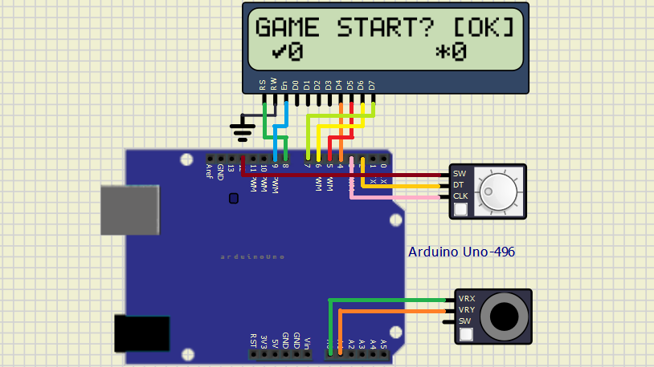
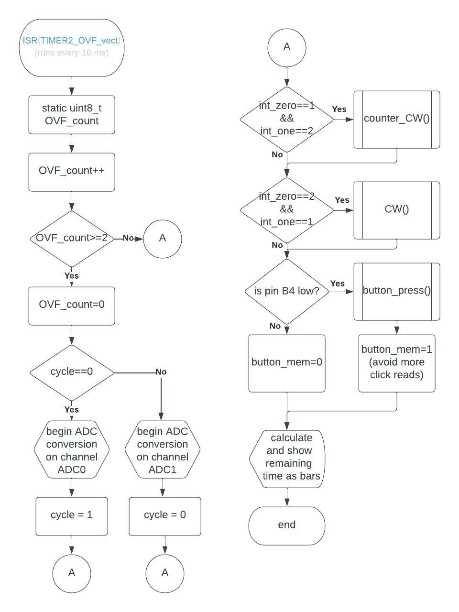
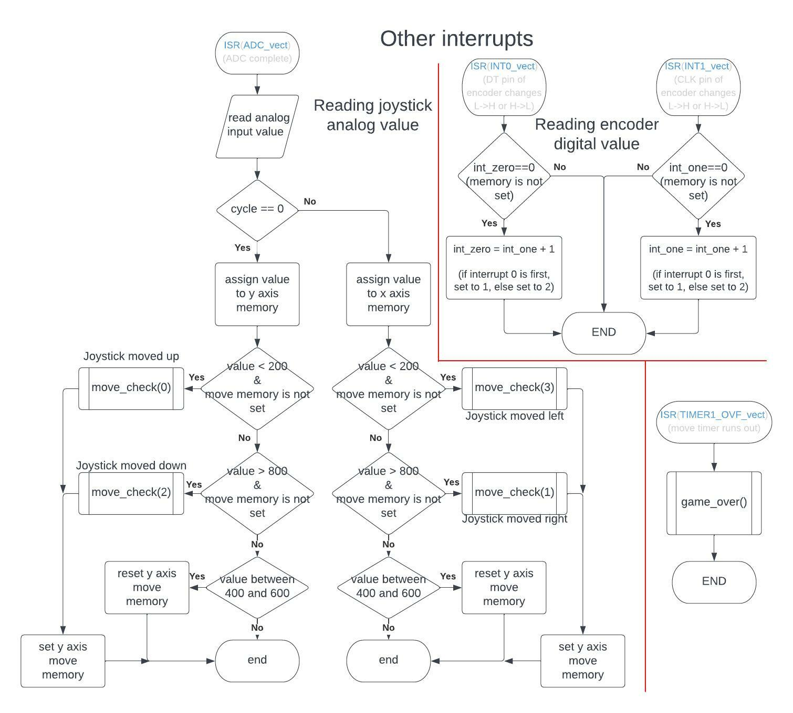

# Project 1

Application of analog joy-stick (2 ADC channels, 1 push button), rotary encoder, and Digilent PmodCLP LCD module.

## Team members

* Tomas Uchytil (responsible for schematic, wiring, code, video and documentation)

## Hardware description

For LCD, I used standard pinout we used in the lab, purely for the ease of use, because that's what Peter Fleury's library is preset to work with. That is:

LCD pins D4 - D7 connected to pins PD4 - PD7 on Arduino, 
LCD pin RS connected to pin PB0 on Arduino, 
LCD pin EN connected to pin PB1 on Arduino.

For joystick, any of six analog inputs were suitable. I chose pins A0 and A1, because we worked with A0 in labs and therefore code modifications didnt't have to be so invasive. Full joystick connection is as follows:

joystick pin VRX is connected to pin PC0 on Arduino, 
joystick pin VRY is connected to pin PC1 on Arduino.

Lastly, the encoder. I didn't have any previous working code for this, therefore pin connections are chosen to be easy to work with encoder. Since I need to read two pulses on two pins quite close together, I chose to not use standard digital reading in timer loop. Instead, I used external interrupts to set variable when signal edge appears. For this reason, I chose to use two pins that support external interrupt. Swith pin doesn't require this, therefore it's choice is random without background thinking:

encoder pin DT is connected to pin PD2 on Arduino, 
encoder pin CLK is connected to pin PD3 on Arduino, 
encoder pin SW is connected to pin PB4 on Arduino.

### Full shematic

## Software description
Timer 2 (continuous, takes care of inputs):

Other interrupts:

Functions - part 1:

Functions - part 2:

There is only one source file where all the programming magic happens, and it's the [main.c](src/main.c) file. However, game program is split into several functions simplifying both orientation in program and programming experience. 

I'll start this documentation by explaining what each function does, then I'll tell something about how the app usually runs.

### function descriptions (sorted by order of appearence in the program)
|function|description|
| :-: | :-: |
|[int]random_int([int]lower, [int]higher)|sets random number as seed of random number generator (unnecessary, I just thought it could increase randomness), then generates another random number, modifies the range to fit function parameters and returns output|
|show_char()|gets random number in range <0,3>from previous function, saves the number to current_char variable, displays arrow (0=up, 1=right 2=down, 3=left) on LCD and updates score on LCD|
|start_game()|resets current game score, sets game_status to 1 (to let other functions know the game is running), calls show_char function to update arrow direction, then starts timer to move the joystick and prefills timer register according to difficulty chosen.|
|end_game()|this function is called, when move timer runs out or when joystick is moved in the wrong direction. It stops the timer, sets game_status to 0 to let other functions know user can interract with menu and displays "game over" message. It then checks if user exceeded the highest score and shows highest score on screen.|
|move_check([int]key)|checks, whether joystick move (presented as function argument) corresponds to arrow displayed. If it does, score is increased, new character shown and move timer reset with new value. If move direction is different, end_game function is called.|
|button_press()|called, when encoder button is pushed. If game is running (status 1), nothong happens. If game just started or finished (status 0), this function shows difficulty choose menu (and sets status 2). If difficulty menu is already shown, button_press starts the game (calls start_game function)|
|CW() and counter_CW()|resets encoder memory (in place to prevent unknown states and false readings), if status=2 (difficulty setting menu), increases and dicreases difficulty from 1 to 5 and shows value on screen.|

### libraries used in project
|library|purpose|
| :-: | :-: |
|[timer](include/timer.h)|to periodically check inputs and time moves|
|[gpio](lib/gpio/gpio.h)|to get encoder button pin readings|
|[lcd](lib/lcd/lcd.h)|to show game on connected LCD|
|[uart](lib/uart/uart.h)|for debugging purposes, not used in final code|

### Sample run of program
When the Arduino is powered on, it shows initial info screen and waits for user confirmation. Game status is set to 0. When user clicks encoder button, game status is set to 2 and difficulty choice menu is shown. Using encoder, user can choose difficulty from 1 to 5. Confirming with another button press, game status is set to 1 and game starts. Then, user is presented with arrow in the left corner and he has preset time limit to move joystick in the displayed direction. Time limit is dependant on difficulty chosen and is displayed on screen in form of progressively appearing bars. If user fails to move the joystick in time or moves it in the wrong way, game is over. Otherwise, new arrow is shown and new countdown begins. After every successful move, current game score is shown on screen, and when the game is over, high score is updated and shown as well.

## Conclusion

I think the project turned out just as I expected. There are only few things I would change if I had more time:

1. encoder reliability: For some reason I don't understand, encoder reads correct way of rotation, but only once for two clics. I don't know, whether it's bug or feature, however, incrementing and decrementing works, so this doesn't really bother me.
2. bar that shows time: seeing it in action, I think it would be clearer, if bars were disappearing, instead of appearing. No added functionality, just more visually appealing.
3. bar length: last thing that came to my mind is also related to time bars. I would love to have bars for all difficulties starting at the same value, and change rate of appearing/disappearing, instead of keeping the rate constant and beginning with i.e. 7 bars prefilled. Again, current way works, I just don't like it that much.

## Video

## simulations

Simulations were done in SimulIDE-0.4.15-SR10, source file for simulation can be found [in simulations folder](simulations/project.simu).

## References

1. [Atmega 328P datasheet](https://ww1.microchip.com/downloads/en/DeviceDoc/Atmel-7810-Automotive-Microcontrollers-ATmega328P_Datasheet.pdf)
2. google images for pinout and connection examples