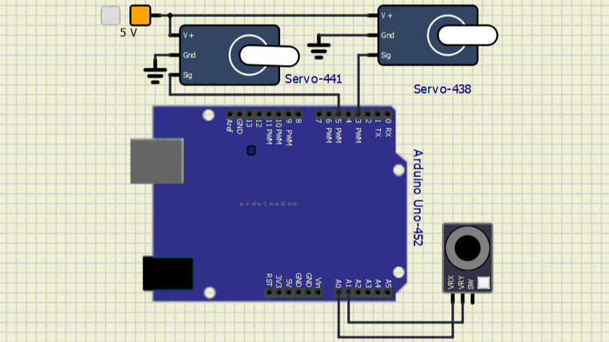
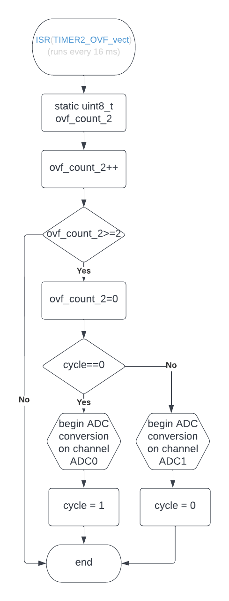

# Project 2

Application of analog joy-stick (or more precisely, just its 2 ADC channels), and 2 servo motors.

## Team members

* Tomas Uchytil (responsible for schematic, wiring, code, video and documentation)

## Hardware description
For joystick, any of six analog inputs were suitable. I chose pins A0 and A1, because I worked with A0  and A1 in previous project and therefore I reused part of code responsible for analog readings. Full joystick connection is as follows:

joystick pin VRX is connected to pin PC0 on Arduino, 
joystick pin VRY is connected to pin PC1 on Arduino.

For Servos, I chosed to use pins 3 and 5 on Arduino (PD3 and PD5), just because I particularly liked these pins the day I programmed it. Pin choice doesn't have anything to do with servos functionality. Pionut is:

Servo 1 orange wire connected to pin PD3 on Arduino, 
Servo 1 red wire connected to 5V on Arduino, 
Servo 1 brown wire connected GND on Arduino, 
Servo 2 orange wire connected to pin PD5 on Arduino, 
Servo 2 red wire connected to 5V on Arduino, 
Servo 2 brown wire connected GND on Arduino, 

### Full shematic

## Software description
Timer 2 (continuous, takes care of inputs):

Timer 1 (for servo PWM) and ADC_vect(when AD conversion is completed):

There is only one source file where all the programming magic happens, and it's the [main.c](src/main.c) file. 

I'll start this documentation by explaining what each function does, then I'll tell something about how the app usually runs.

### libraries used in project
|library|purpose|
| :-: | :-: |
|delay|to precisely control output pulse length|
|[timer](include/timer.h)|to periodically check inputs and generate PWM|
|[gpio](lib/gpio/gpio.h)|to control servo outputs|
|[uart](lib/uart/uart.h)|for debugging purposes, not used in final code|

### Sample run of program
In this application, Arduino reads periodically value of connected joystick. Then, it generates PWM signal used to control two connected servos. 

Every 32 milliseconds, one axis of joystick is read and value stored in corresponding variables. Then, approximately every 20 ms, PWM pulse is generated. First, I take value of both joystick axis and scale it. First, I multiply it by 1,6 to increase range of movement, then I divide and multiply by 10 to round it (this decreases accuracy, but makes servos less susceptible to noise and frequent movements due to subtle joystick vibrations), and finaly I add 650 to move movement range to servo vorking area. 

Pulses of all servos begin at the same time. All outputs are set high, and then the delay function is called for the shortest time. After that time is over, respective servo is turned off. Than the same is done for other servos, while always subtracting elapsed delay.

## Conclusion

I think the project turned out just as I expected. Use of delay in program is far from ideal, but since servos used don't require precise PWM length, I deem it the easiest and probably most precise option. Other approaches I tried, like high frequency timer overflows incrementing value until it is higher than desired pulse length, either failed right away or missed desired precision. I figured out it would be better to have precise controls even at the cost of total PWM length being slightly longer (after all, maximum pulse length is about 2,5 ms, which is fraction of whole PWM length).

Program I created can be used in several different ways. In this exact configuration with joystick, it can be used to control for example balancing pad, RC car etc. If we changed joystisk for several potentiometers, it could be used to control water flow from remote location etc. etc.

My solution is very scalable, since it allows adding more servos just by adding delays and outputs, up to maximum of available digital outputs. With more outputs, program of course becomes more complex, because we have to sort output pulses by lengths and substract them from each other, however, I think processor in question is more then capable to handle it.

## Video

## simulations

Simulations were done in SimulIDE-0.4.15-SR10, source file for simulation can be found [in simulations folder](simulations/project.simu).

## References

1. [Atmega 328P datasheet](https://ww1.microchip.com/downloads/en/DeviceDoc/Atmel-7810-Automotive-Microcontrollers-ATmega328P_Datasheet.pdf)
2. google images for pinout and connection examples
3. [RC car image for video](https://www.youtube.com/watch?v=ExQotTzmmiQ)
4. [ballance pad image for video](https://create.arduino.cc/projecthub/davidhamor/ball-and-plate-c48027)